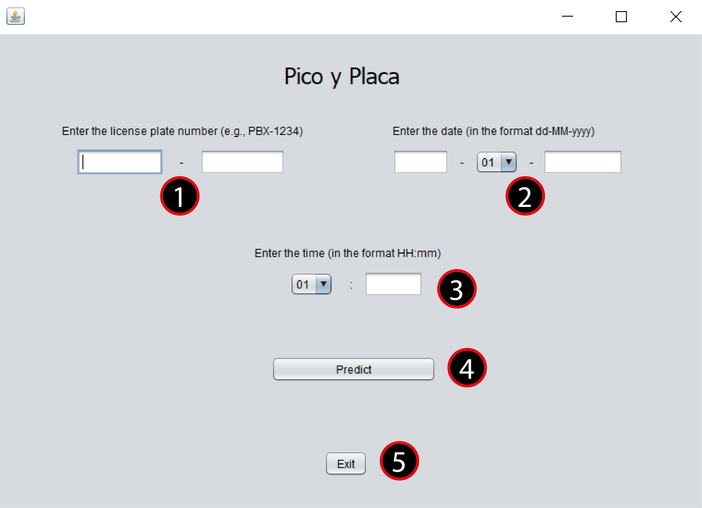
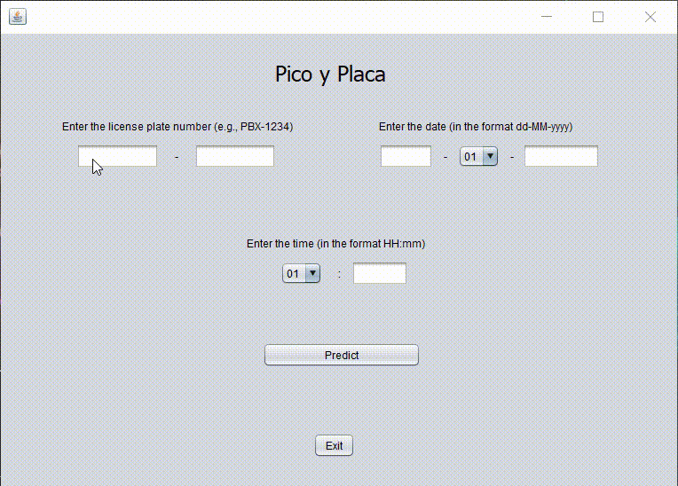
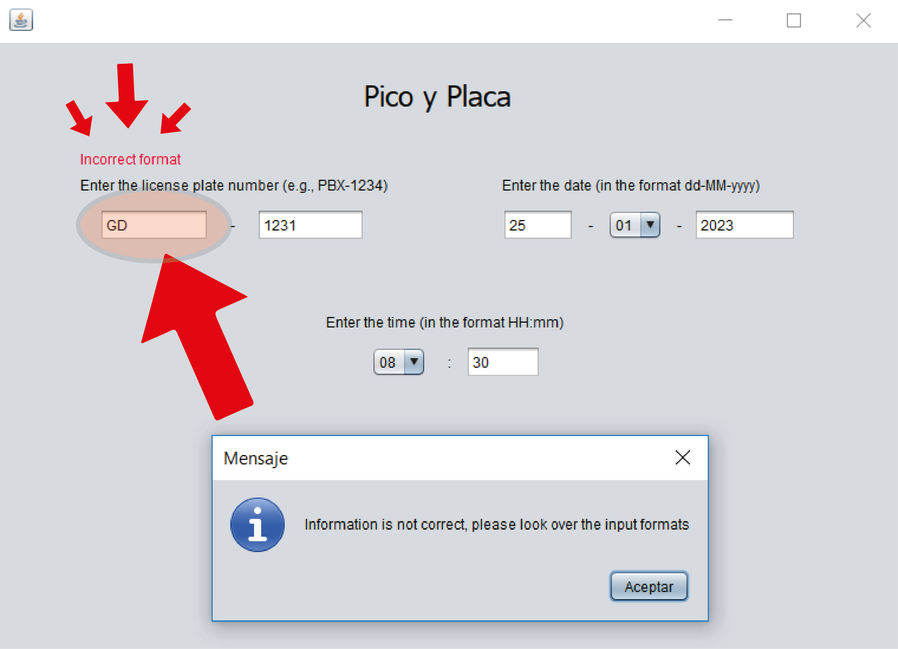

<h1 align="center"> Pico&Placa Predictor 🕐	🚗 </h1>    

  

- Table of contents
  - [Introduction](#-introduction)
  - [Frame and Approach](#-frame-and-approach)
  - [Requirements](#requirements)
  - [How to Install](#-how-to-install)
  - [Usage](#-usage)
  - [Graphic user interface](#-graphic-user-interface)
  - [🚘	 Examples](#-examples)
    - [Predict day](#predict-day)
    - [Predict hour](#predict-hour)
    - [Missing information in Prediction](#missing-information-in-prediction)
  - [Links](#-links)
  - [Feedback](#-feedback)
  - [License](#-license)

## Introduction
Graphical user interface to predict Pico&Placa regulation by car's plate license. It was considered Ecuadorian rule of the Pico&Placa. In addition, the rules are established in this way 

Hours: 
* 07:00  - 09:30  
* 16:00  - 19:30 

Days: 
* 1, 2 = Monday  
* 3, 4 = Tuesday  
* 5, 6 = Wednesday 
* 7, 8 = Thursday  
* 9, 0 = Friday

Built with JAVA.

## Frame and Approach
- Supports any license plate and any date.
- Includes 24 hours a day. See an [example](#-examples).
- Includes total time per day. See an [example](#-examples).
- Includes both weekdays and weekends. See an [example](#-examples).
- It doesn't support national holidays
- Requires Java SE Development Kit 11+.

## Requirements

For using Pico&Placa predictor it is necessary to have the following information to generate a query

- **"License plate":** The car's identification in format XXX-0000.
- **"Date":** the day for query in format dd-mm-yyyy.
- **"Hours":** the hour for query in format HH:mm.

To know how to enter the information, please review [Graphical user interface](#-graphical-user-interface)

## How to Install

This software requires [Install Java SE 11+](https://www.oracle.com/in/java/technologies/javase/jdk11-archive-downloads.html), and one IDE like [NetBeans 16](https://netbeans.apache.org/download/index.html) for compilating the JAVA code

## Graphic user interface

1. License plate number: The first field only accepts letters and the second only numbers. Format **XXX-0000**.
2. Date: The first field is for the date, the combo box for the month, and the last field for the year. Format **dd-mm-yyyy**.
3. Time: The combo box is for the hour, and the field for the minutes. Format **HH:mm**.
4. Predict Button: Calculate if the car can be or not on the road in the day and hour specificated
5. Exit Button: Close the window

## Usage

The operation of the program consists of filling in the fields through the graphical interface according to the established formats. Once this is done, the predict button is pressed to obtain the result of whether the car to which the license plate corresponds can be on the road that day at that time

## 🚘	 Examples

To show how the program works, examples from different scales will be used. The first example will be to show how the program behaves during the week, while the second will be to show the program's behavior in a single day.

### Predict day
🚗 License Plate PDX-1226 / Last digit = 6
| Day       | 07:00 - 09:30       | 16:00  - 19:30     |
| --------- | ------------------- | ------------------ | 
| Monday    | yes                 | yes                | 
| Tuesday   | yes                 | yes                |  
| Wednesday | no                  | no                 | 
| Thursday  | yes                 | yes                |  
| Friday    | yes                 | yes                |
| Saturday  | yes                 | yes                | 
| Sunday    | yes                 | yes                |  

🚙	License Plate IBB-5890 / Last digit = 0
| Day       | 07:00  - 09:30      | 16:00  - 19:30     |
| --------- | ------------------- | ------------------ | 
| Monday    | yes                 | yes                | 
| Tuesday   | yes                 | yes                |  
| Wednesday | yes                 | yes                | 
| Thursday  | yes                 | yes                |  
| Friday    | no                  | no                 | 
| Saturday  | yes                 | yes                | 
| Sunday    | yes                 | yes                |

### Predict Hour

🚗 License Plate PDX-1226 / Last digit = 6 / Wednesday
| Day                 | Allow to be on the road?   |
| -----------------   | -------------------------- | 
| 00:00  - 06:59      |             yes            | 
| 07:00  - 09:30      |             no             |
| 09:31  - 15:59      |             yes            |
| 16:00  - 19:30      |             no             | 
| 19:31  - 24:00      |             yes            |

### Missing information in Prediction
In the event that all the fields have not been filled in correctly, when making the prediction a window will appear indicating that there is an error in the format of any of the fields.

Additionally, in the field where the error exists, a message will appear in red letters saying "Incorrect format"

## Links

- [Install Java SE Development Kit 11.0.17](https://www.oracle.com/in/java/technologies/javase/jdk11-archive-downloads.html)
- [Install NetBeans 16](https://netbeans.apache.org/download/index.html)

